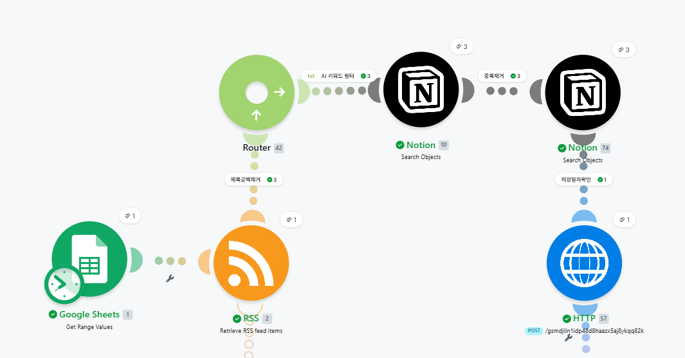
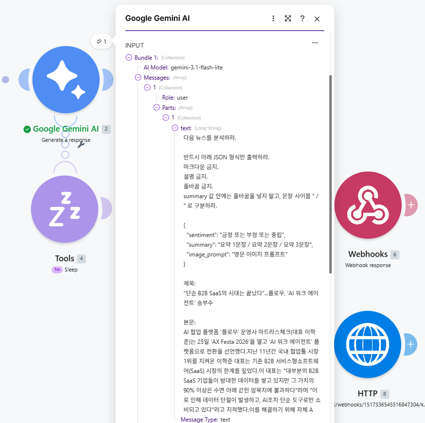
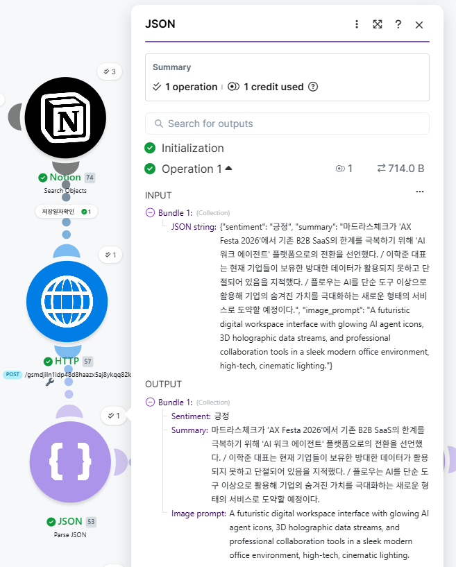
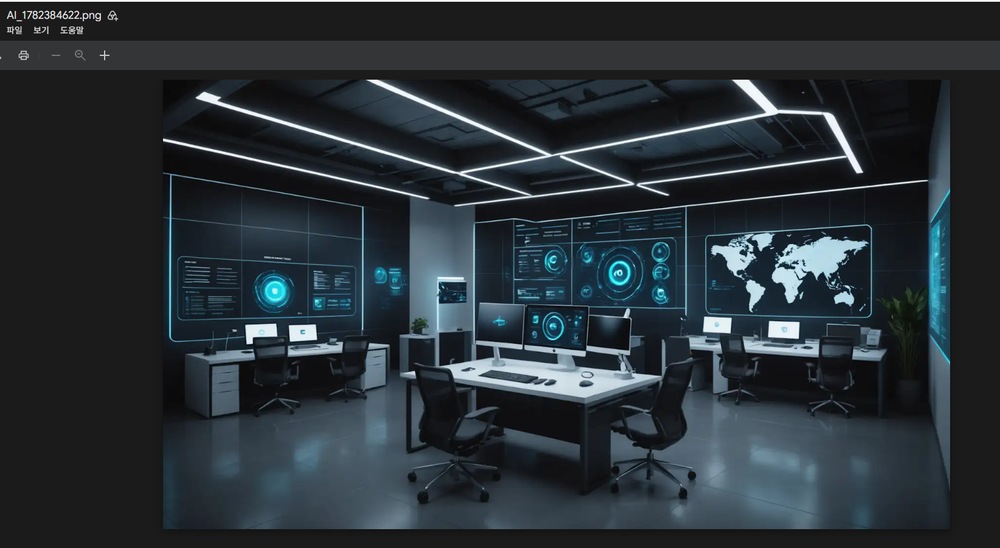
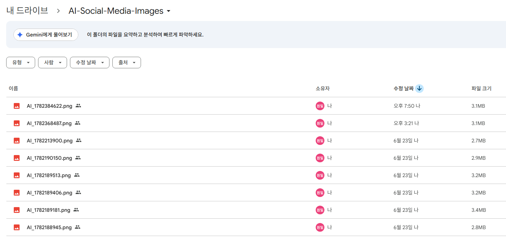

# 프로젝트 실행 결과 및 테스트 보고서

## 프로젝트명

RSS 기반 AI 기술 뉴스 자동 수집 및 요약 시스템

---

# 1. 테스트 개요

본 프로젝트는 RSS를 이용한 최신 AI 기술 뉴스 자동 수집부터 생성형 AI를 활용한 기사 요약, AI 이미지 생성, Notion 자동 저장까지 전체 자동화 워크플로우가 정상적으로 동작하는지 검증하기 위해 단계별 테스트를 수행하였다.

또한 URL 기반 중복 검사, 하루 1건 저장 정책, API 재시도 등 예외 상황에 대한 테스트도 함께 진행하였다.

---

# 2. 테스트 환경

| 항목 | 내용 |
|------|------|
| 자동화 플랫폼 | Make |
| 생성형 AI | Google Gemini |
| 이미지 생성 AI | Stability AI |
| 데이터 저장 | Notion |
| 이미지 저장 | Google Drive |
| RSS 관리 | Google Sheets |
| 오류 알림 | Discord |
| 테스트 환경 | Windows 11 / Chrome |

---

# 3. 테스트 시나리오

| 테스트 항목 | 기대 결과 | 결과 |
|-------------|-----------|:---:|
| Scheduler 자동 실행 | 지정된 시간에 워크플로우 실행 | ✅ |
| RSS 뉴스 수집 | 최신 기사 조회 | ✅ |
| 제목 검증 | 제목이 없는 기사 제외 | ✅ |
| AI 기사 필터링 | AI 관련 기사만 통과 | ✅ |
| URL 중복 검사 | 동일 기사 저장 방지 | ✅ |
| 저장일자 검사 | 하루 1건 저장 | ✅ |
| Gemini 요약 | 3줄 요약 생성 | ✅ |
| 감성 분석 | 긍정 / 부정 / 중립 분류 | ✅ |
| 이미지 프롬프트 생성 | 영문 프롬프트 생성 | ✅ |
| Stability AI | 썸네일 생성 | ✅ |
| Google Drive 업로드 | 공유 링크 생성 | ✅ |
| Notion 저장 | 데이터 정상 저장 | ✅ |

---

# 4. 실행 결과

## 4-1. 메인 시나리오 실행

### 검증 포인트

- Scheduler 정상 실행
- RSS 기사 자동 수집
- AI 기사 필터링
- URL 중복 검사
- 저장일자 검사
- Gemini 하위 시나리오 호출
- 이미지 생성 및 Notion 저장

---

## 4-2. 하위 시나리오 실행

### 검증 포인트

- Webhook 데이터 정상 수신
- Google Gemini 정상 호출
- JSON 응답 생성
- 메인 시나리오 정상 반환

---

## 4-3. 기사 필터링 결과

### 검증 포인트

- 제목 존재 여부 확인
- AI 키워드 필터 적용
- URL 중복 검사
- 저장일자 검사
- 하루 1건 저장 정책 적용

### 결과

RSS에서 수집된 기사 중 제목이 존재하는 기사만 통과하도록 구성하였으며, AI 키워드 필터를 적용하여 AI 관련 기사만 다음 단계로 전달하였다.

또한 URL 중복 검사와 저장일자 검사를 통해 동일 기사 저장과 하루 1건 이상 저장되는 상황을 방지하였다.

---

## 4-4. Gemini Result

### 검증 포인트

생성 결과

- summary
- sentiment
- image_prompt

### 결과

Google Gemini가 기사 내용을 분석하여 3줄 요약, 감성 분석 결과, 이미지 생성 프롬프트를 JSON 형식으로 정상 생성하는 것을 확인하였다.

---

## 4-5. Parse JSON 결과

### 검증 포인트

분리된 데이터

- summary
- sentiment
- image_prompt

### 결과

Gemini의 JSON 응답을 Parse JSON 모듈에서 각각의 데이터로 정상 분리하여 이후 이미지 생성 및 Notion 저장 단계에서 활용할 수 있음을 확인하였다.

---

## 4-6. Stability AI 이미지 생성

### 검증 포인트

- 이미지 생성 성공
- PNG 파일 생성
- 기사 내용과 일치하는 이미지 생성

---

## 4-7. Google Drive 업로드

### 검증 포인트

- PNG 업로드 성공
- 공유 링크 생성
- Notion 연동 가능

---

## 4-8. Notion 저장 결과

### 저장 항목

- 제목
- 요약문
- 감성 태그
- 원문 링크
- 발행일시
- 저장일자
- 이미지 링크

### 결과

모든 데이터가 정상적으로 저장되었으며 기사별 정보를 데이터베이스 형태로 관리할 수 있음을 확인하였다.

---

# 5. 기능별 검증 결과

| 기능 | 검증 결과 |
|------|:---:|
| RSS 자동 수집 | ✅ |
| 제목 검증 | ✅ |
| AI 기사 필터링 | ✅ |
| URL 중복 검사 | ✅ |
| 저장일자 검사 | ✅ |
| Gemini 요약 | ✅ |
| 감성 분석 | ✅ |
| 이미지 프롬프트 생성 | ✅ |
| Stability AI 이미지 생성 | ✅ |
| Google Drive 업로드 | ✅ |
| Notion 자동 저장 | ✅ |

---

# 6. 예외 처리 테스트

| 테스트 항목 | 테스트 내용 | 결과 |
|-------------|-------------|:---:|
| 제목 없음 | 제목이 없는 기사 제외 | ✅ |
| URL 중복 | 동일 기사 저장 방지 | ✅ |
| 저장일자 존재 | 하루 1건 정책 적용 | ✅ |
| Gemini API 실패 | 최대 2회 재시도 | ✅ |
| 이미지 생성 실패 | 이미지 없이 기사 저장 | ✅ |

---

# 7. 최종 구현 기능

| 구현 기능 | 완료 |
|-----------|:---:|
| RSS 자동 수집 | ✅ |
| AI 기사 필터링 | ✅ |
| 제목 검증 | ✅ |
| URL 중복 검사 | ✅ |
| 하루 1건 저장 | ✅ |
| Google Gemini 요약 | ✅ |
| 감성 분석 | ✅ |
| 이미지 프롬프트 생성 | ✅ |
| Stability AI 이미지 생성 | ✅ |
| Google Drive 업로드 | ✅ |
| Notion 자동 저장 | ✅ |
| Webhook 기반 최대 2회 재시도 | ✅ |
| 전 과정 자동 실행 | ✅ |

---

# 8. 프로젝트 결과 요약

본 프로젝트에서는 RSS를 이용한 최신 AI 기술 뉴스 자동 수집부터 생성형 AI 기반 뉴스 요약, 감성 분석, AI 이미지 생성, Google Drive 업로드, Notion 자동 저장까지 전 과정을 하나의 자동화 워크플로우로 구현하였다.

또한 URL 기반 중복 검사와 저장일자 검사를 통해 동일 기사 저장을 방지하고, 하루 1건 저장 정책을 적용하였다. Gemini API는 Webhook 기반 최대 2회 재시도 구조를 적용하여 일시적인 오류에도 안정적으로 동작하도록 설계하였다.

최종 테스트 결과 모든 기능이 정상적으로 동작하였으며, 프로젝트 목표와 과제 요구사항을 모두 만족하는 자동화 시스템을 구현하였다.

---

# 9. 향후 개선 사항

- RSS 소스 확대 및 카테고리별 관리
- AI 키워드 자동 추천 기능
- 기사 중요도 자동 분류
- Slack 및 이메일 알림 기능 추가
- 주간·월간 뉴스 리포트 자동 생성
- 다국어 뉴스 번역 기능 추가
