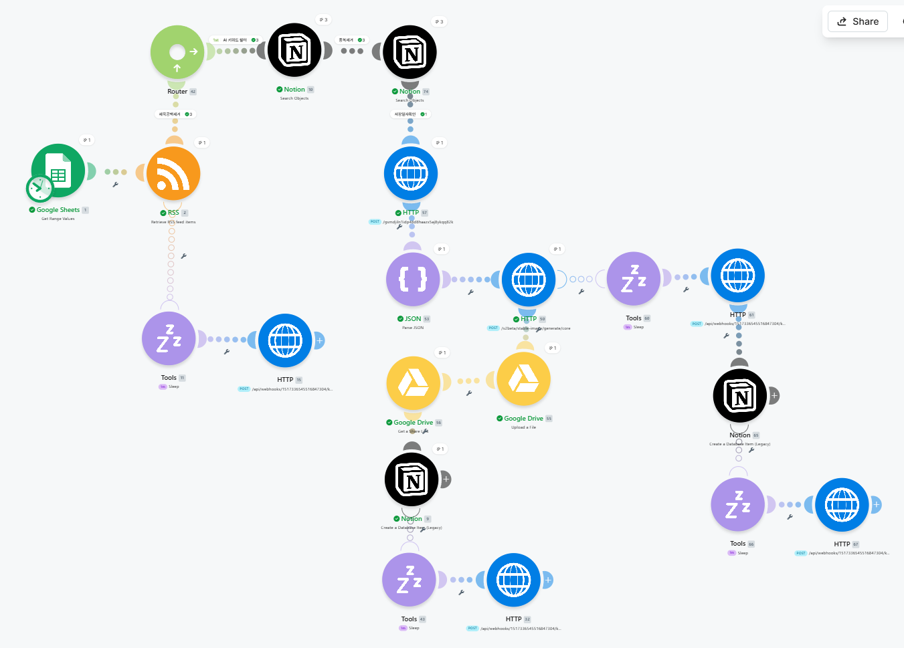
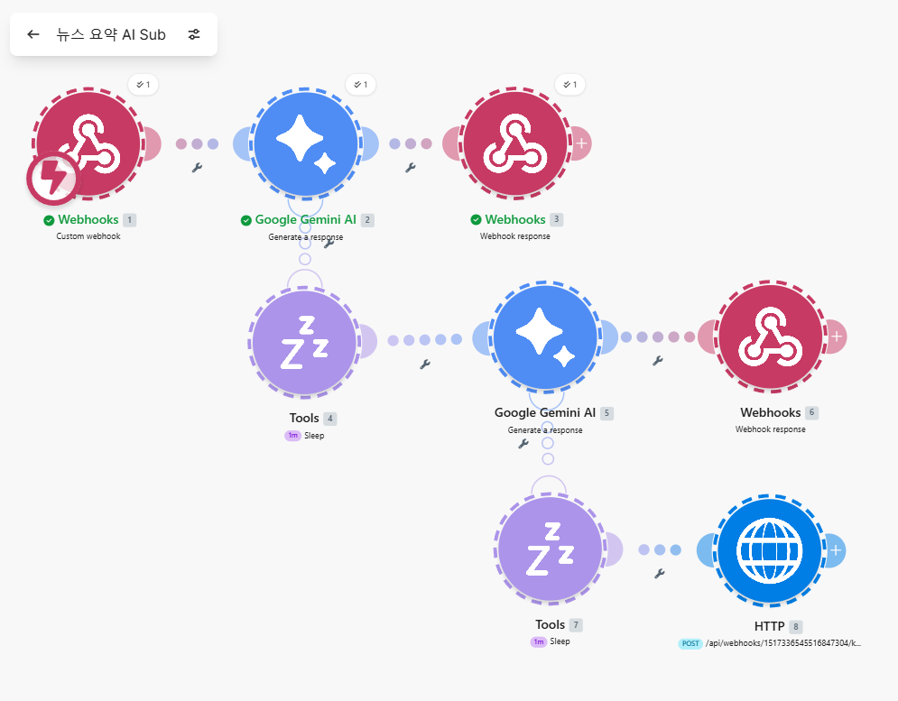
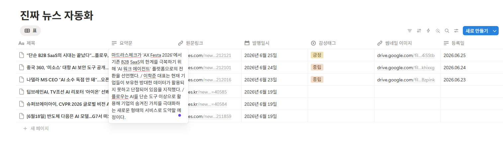

# RSS 기반 AI 기술 뉴스 자동 수집 및 요약 시스템

<p align="center">


</p>

<p align="center">


</p>

---

## 프로젝트 소개

본 프로젝트는 RSS를 활용하여 최신 AI 기술 뉴스를 자동으로 수집하고, Google Gemini를 이용하여 기사 요약 및 감성 분석을 수행한 뒤 AI 썸네일 이미지를 생성하여 Notion 데이터베이스에 자동 저장하는 Make 기반 자동화 시스템입니다.

또한 URL 기반 중복 기사 제거, 하루 1건 저장 정책, Webhook 기반 API 재시도, Discord 오류 알림 기능을 적용하여 실제 운영 환경을 고려한 안정적인 자동화 워크플로우를 구현하였습니다.

---

# 프로젝트 목표

- 최신 AI 기술 뉴스 자동 수집
- 생성형 AI를 활용한 뉴스 요약 자동화
- AI 기반 뉴스 썸네일 생성
- Notion 데이터베이스 자동 관리
- 반복 업무 자동화를 통한 정보 수집 효율 향상

---

# 핵심 기능

| 기능 | 구현 |
|------|:---:|
| RSS 자동 수집 | ✅ |
| AI 기사 자동 필터링 | ✅ |
| Google Gemini 뉴스 요약 | ✅ |
| 감성 분석 | ✅ |
| AI 이미지 생성 | ✅ |
| Google Drive 저장 | ✅ |
| Notion 자동 저장 | ✅ |
| URL 기반 중복 제거 | ✅ |
| 하루 1건 저장 | ✅ |
| Gemini 최대 2회 재시도 | ✅ |
| Discord 오류 알림 | ✅ |
| 전 과정 자동 실행 | ✅ |

---

# 시스템 구조

## 메인 시나리오



---

## 하위 시나리오



---

# 기술 스택

| 분야 | 사용 기술 |
|------|-----------|
| 자동화 플랫폼 | Make |
| 생성형 AI | Google Gemini |
| 이미지 생성 | Stability AI |
| 데이터 저장 | Notion Database |
| 이미지 저장 | Google Drive |
| RSS 관리 | Google Sheets |
| 오류 알림 | Discord |
| 통신 | HTTP / Webhook |

---

# 프로젝트 구조

```text
AI-RSS-News-Automation
│
├── README.md
├── 01_Project_Plan.md
├── 02_Workflow_Description.md
├── 03_Project_Decision_Log.md
├── 04_Project_Result.md
│
└── images
    ├── workflow_main.png
    ├── workflow_sub.png
    ├── filter_result.png
    ├── gemini_result.png
    ├── json_parse.png
    ├── thumbnail.png
    ├── drive_result.png
    ├── notion_result.png
    └── discord_error.png
```

---

# 프로젝트 문서

| 문서 | 설명 |
|------|------|
| 📄 01_project_planning.md | 프로젝트 기획서 및 팀 역할 |
| 📄 02_workflow_description.md | 워크플로우 구성 및 모듈 설명 |
| 📄 03_project_decision_log.md | 프로젝트 기획 및 의사결정 기록 |
| 📄 04_project_result.md | 실행 결과 및 테스트 보고서 |

---

# 프로젝트 설계 및 구현 설명

## 시스템 전체 흐름

본 프로젝트는 Make Scheduler를 기반으로 설정된 시간에 자동 실행되며, 최신 AI 기술 뉴스를 수집한 후 AI 요약 및 이미지 생성을 거쳐 Notion 데이터베이스에 자동 저장한다.

```text
Scheduler
    │
    ▼
RSS 기술 뉴스 수집
    │
    ▼
제목 공백 제거 (Exists Filter)
    │
    ▼
AI 키워드 필터링
    │
    ▼
URL 중복 검사
    │
    ▼
오늘 저장 여부 확인
    │
    ▼
Google Gemini 뉴스 요약 및 감성 분석
    │
    ▼
JSON Parsing
    │
    ▼
Stability AI 이미지 생성
    │
    ▼
Google Drive 업로드
    │
    ▼
Notion Database 저장
    │
    ▼
오류 발생 시 Discord 알림
```

---

# 1. Scheduler 자동 실행

## 구현 목적

사용자의 개입 없이 최신 AI 기술 뉴스를 자동으로 수집하기 위해 Make Scheduler를 사용하였다.

## 동작 방식

* 설정된 스케줄에 따라 자동 실행
* RSS Feed 확인
* 새로운 기사 존재 여부 확인
* 전체 워크플로우 자동 수행

## 구현 결과

* 사람이 직접 실행하지 않아도 자동 동작
* 실행 결과는 Make 실행 히스토리를 통해 확인 가능

**증빙 이미지**

* schedule_setting.png
* schedule_history.png

---

# 2. RSS 뉴스 자동 수집

## RSS란?

RSS(Really Simple Syndication)는 XML 기반 뉴스 제공 방식으로, 새로운 기사가 등록되면 제목, 링크, 발행일 등의 정보를 자동으로 제공한다.

## 구현 방식

Make의 RSS 모듈을 이용하여 지정한 기술 뉴스 RSS Feed를 주기적으로 조회하였다.

수집 항목

* 기사 제목
* 기사 링크
* 발행일시
* 기사 본문

## 구현 결과

별도의 크롤링 없이 최신 AI 기술 뉴스를 자동으로 수집할 수 있도록 구현하였다.

**증빙 이미지**

* rss_module.png
* rss_result.png

---

# 3. AI 기사 필터링

## 구현 목적

모든 기술 뉴스를 저장하지 않고 AI 관련 기사만 저장하기 위해 키워드 필터링을 적용하였다.

## 사용 키워드

* AI
* LLM
* OpenAI
* 인공지능
* 생성형 AI

## 선정 이유

AI 기술은 다양한 명칭으로 표현되기 때문에 특정 단어 하나만 사용할 경우 관련 기사가 누락될 가능성이 있다.

대표적인 기술명(LLM), 기업명(OpenAI), 일반 용어(AI, 인공지능, 생성형 AI)를 함께 사용하여 재현성과 정확도를 높였다.

---

# 4. 제목 공백 제거

## 구현 목적

RSS Feed에서 제목이 비어있는 데이터를 처리하지 않도록 필터를 적용하였다.

## 구현 방법

Make Filter의 **Exists 조건**을 사용하여 제목이 존재하는 경우에만 다음 단계로 진행하도록 구성하였다.

## 구현 결과

빈 제목으로 인해 발생할 수 있는 AI 요약 오류 및 저장 오류를 방지하였다.

---

# 5. URL 기반 중복 제거

## 구현 목적

동일한 기사가 반복 저장되는 것을 방지하기 위해 URL을 기준으로 중복 여부를 판단하였다.

## URL을 선택한 이유

기사 제목은 수정될 수 있지만 URL은 동일 기사에 대해 고유하게 유지된다.

따라서 URL을 중복 판단 기준으로 사용하는 것이 가장 안정적이며 재현성이 높다.

## 구현 방법

* Notion Search Objects
* URL 비교
* 동일 URL 존재 시 저장하지 않음

---

# 6. 하루 1건 저장 정책

## 구현 목적

과제 요구사항에 따라 하루에 1건만 저장하도록 구현하였다.

## 구현 방법

Notion Database의 **저장일(Date)** 속성을 이용하여

오늘 저장된 데이터가 존재하는 경우

추가 저장을 수행하지 않도록 구성하였다.

## 구현 결과

동일 날짜에 여러 기사가 저장되지 않도록 제어하였다.

---

# 7. Google Gemini 뉴스 요약

## 구현 목적

기사의 핵심 내용을 짧고 명확하게 요약하여 저장하기 위함이다.

## 프롬프트 설계 기준

* 핵심 내용만 추출
* 최대 3줄 이내 요약
* 객관적인 표현 사용
* 감성 분석 수행
* 이미지 생성 프롬프트 생성

## 출력 결과

Gemini는 아래 정보를 JSON 형태로 반환한다.

* sentiment
* summary
* image_prompt

이를 Parse JSON 모듈을 이용하여 각각 분리하였다.

---

# 8. JSON Parsing

Gemini의 응답은 JSON 문자열 형태로 전달된다.

Parse JSON 모듈을 이용하여

* 감성 분석
* 뉴스 요약
* 이미지 프롬프트

를 각각 추출하여 다음 단계에서 사용할 수 있도록 구성하였다.

---

# 9. AI 이미지 생성

## 구현 목적

기사 내용을 대표하는 썸네일 이미지를 자동 생성하기 위함이다.

## 구현 방법

Gemini가 생성한 image_prompt를 Stability AI에 전달하여 이미지를 생성하였다.

생성된 이미지는 Google Drive에 자동 업로드한 후 공유 링크를 획득하였다.

---

# 10. Google Drive 저장

생성된 이미지는 Google Drive에 저장하였다.

Google Drive에서 생성된 공유 링크를 Notion에 함께 저장하여 썸네일을 표시하도록 구성하였다.

---

# 11. Notion Database 저장

최종적으로 아래 정보를 자동 저장하였다.

* 기사 제목
* 뉴스 요약
* 감성 분석
* 원문 링크
* 발행일시
* AI 생성 이미지
* 저장일

이미지 생성 실패 시에도 핵심 데이터는 정상적으로 저장되도록 예외 처리를 적용하였다.

---

# 12. 예외 처리 정책

## Google Gemini

* 최대 2회 재시도
* 계속 실패 시 Discord 알림

## Stability AI

이미지 생성 실패 시에도 기사 저장은 계속 진행하도록 구성하였다.

이미지는 부가 기능이며, 기사 저장이 프로젝트의 핵심 기능이기 때문이다.

## Discord

주요 API 호출 오류 발생 시 Discord Webhook을 통해 오류 내용을 즉시 확인할 수 있도록 구현하였다.

---

# 프로젝트 구현 결과

본 프로젝트는 아래 기능을 모두 자동화하였다.

* Scheduler 자동 실행
* RSS 뉴스 자동 수집
* 제목 공백 제거
* AI 키워드 필터링
* URL 중복 제거
* 하루 1건 저장 정책
* Google Gemini 뉴스 요약
* JSON Parsing
* Stability AI 이미지 생성
* Google Drive 자동 저장
* Notion Database 자동 저장
* Discord 오류 알림

사람의 개입 없이 전체 프로세스가 자동 수행되며, AI 기술 뉴스 수집부터 요약·이미지 생성·데이터 저장까지 하나의 워크플로우로 구현하였다.


---

# 구현 결과

### Notion 자동 저장 결과



RSS에서 수집한 AI 기술 뉴스가 Google Gemini를 통해 요약 및 감성 분석된 후 AI 썸네일과 함께 Notion 데이터베이스에 자동 저장되는 것을 확인하였다.

> 자세한 테스트 결과 및 검증 과정은 **docs/04_project_result.md** 문서를 참고한다.

---

# 프로젝트 성과

- RSS 기반 최신 AI 기술 뉴스 자동 수집 구현
- Google Gemini 기반 뉴스 요약 및 감성 분석 자동화
- Stability AI 기반 뉴스 썸네일 자동 생성
- Google Drive 자동 업로드 및 공유 링크 생성
- Notion 데이터베이스 자동 저장
- URL 기반 중복 기사 제거
- 하루 1건 저장 정책 구현
- Webhook 기반 최대 2회 API 재시도
- Discord 오류 알림 기능 구현
- 사람의 개입 없이 전체 프로세스 자동 실행

---

# 향후 개선 사항

- RSS 뉴스 소스 확대
- AI 키워드 자동 추천 기능
- 기사 중요도 자동 분류
- Slack 및 이메일 알림 연동
- 주간·월간 뉴스 리포트 자동 생성
- 다국어 뉴스 번역 기능 추가

---

# Team

| 역할 | 담당 |
|------|------|
| 팀장 | 이원일 |
| 팀원 | 김호연 |
| 팀원 | 조경학 |
| 팀원 | 최주현 |
| 팀원 | 위홍빈 |
| 팀원 | 김민수 |

---

## 프로젝트 문서 바로가기

# 프로젝트 문서

- 📄 [01. 프로젝트 기획서](/01_Project_Plan.md)
- 📄 [02. 워크플로우 설명서](/02_Workflow_Description.md)
- 📄 [03. 프로젝트 기획 및 의사결정](/03_project_decision_log.md)
- 📄 [04. 실행 결과 및 테스트 보고서](04_project_result.md)
